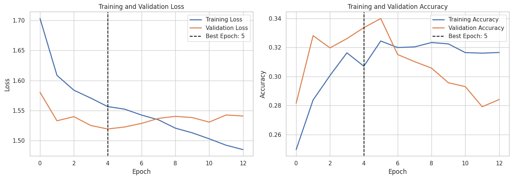
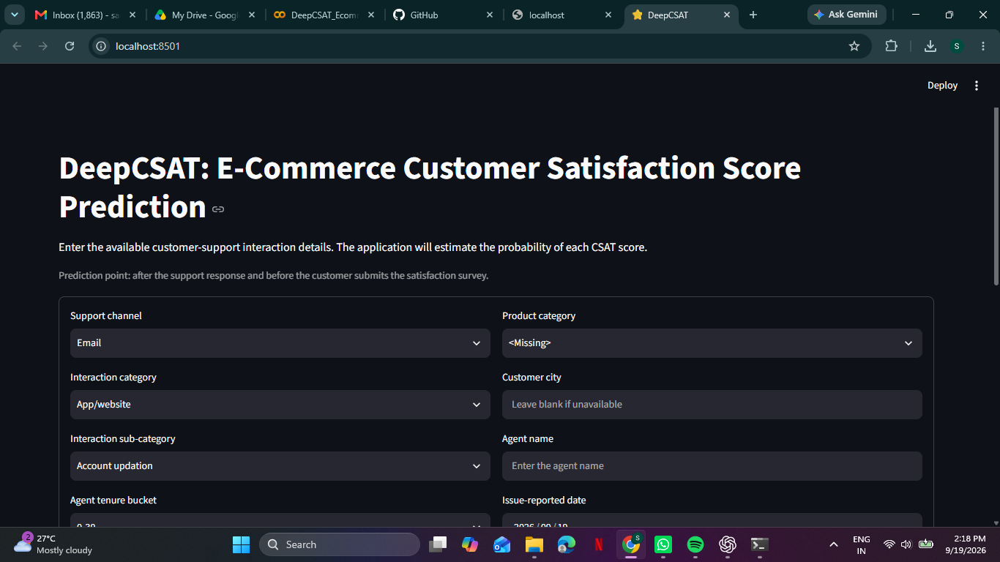
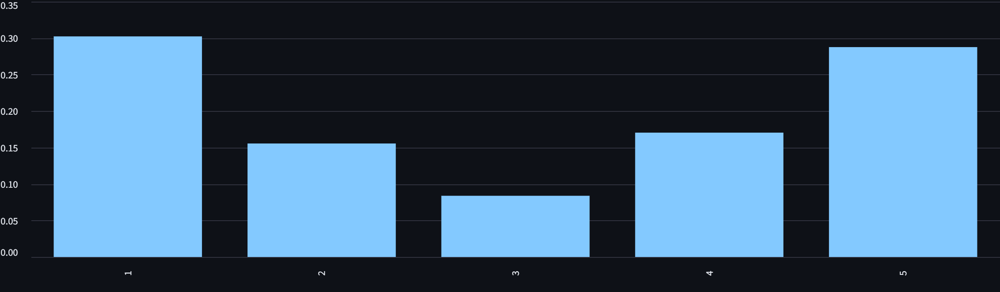
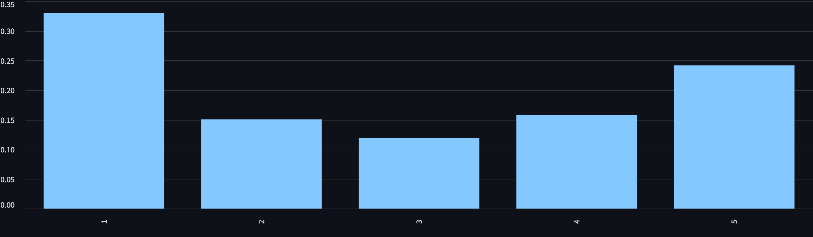

# DeepCSAT: E-Commerce Customer Satisfaction Score Prediction


DeepCSAT is an end-to-end deep learning project for predicting Customer Satisfaction (CSAT) scores from e-commerce customer-support interactions. The project covers data validation, exploratory analysis, feature engineering, ANN development, model evaluation, interpretability and local deployment through Streamlit.


## Business Problem


Customer satisfaction directly affects retention, repeat purchases and brand reputation. Manually reviewing every customer interaction is time-consuming. DeepCSAT estimates the probability of CSAT scores from 1 to 5, enabling support teams to identify interactions with a higher risk of customer dissatisfaction.


## Project Objectives


- Validate and clean customer-support interaction data

- Analyze factors associated with customer satisfaction

- Engineer operational, temporal and missing-value features

- Develop and optimize an Artificial Neural Network

- Evaluate performance using multiclass and ordinal metrics

- Interpret the model using grouped permutation importance

- Deploy the trained pipeline as a local Streamlit application


## Dataset


The dataset contains **85,907 customer-support interactions** collected from the Shopzilla e-commerce platform.


The target variable is `CSAT Score`, with values from 1 to 5.


Major input features include:


- Support channel, interaction category and sub-category

- Customer remarks and location

- Product category and item price

- Order and support timestamps

- Agent, supervisor, manager, tenure and shift

- Connected handling time


## Project Workflow


1. Data integrity and quality assessment

2. Missing-value and duplicate analysis

3. Date and timestamp parsing

4. Exploratory data analysis

5. Feature engineering

6. Chronological train-validation-test split

7. Frequency and one-hot encoding

8. Numerical imputation and scaling

9. ANN development and optimization

10. Model evaluation and interpretation

11. Model artifact validation

12. Local deployment using Streamlit


## Feature Engineering


The project includes:


- Customer-support response time

- Time between order placement and issue reporting

- Issue hour, weekday and weekend indicators

- Log transformations for skewed numerical variables

- Missing-information indicators

- Frequency encoding for high-cardinality features

- One-hot encoding for low-cardinality features


The final model uses **153 processed features**.


## ANN Architecture


The neural network contains:


- Dense hidden layers with ReLU activation

- Batch normalization

- Dropout regularization

- Five-neuron softmax output layer

- Adam optimizer

- Early stopping

- Learning-rate reduction

- Smoothed class weights to address class imbalance


## Model Performance


The tuned ANN was selected using validation Macro-F1 and then evaluated once on the chronological test set.


| Metric | Test Result |

|---|---:|

| Accuracy | 0.6886 |

| Macro Precision | 0.2355 |

| Macro Recall | 0.2393 |

| Macro F1 | 0.2193 |

| Weighted F1 | 0.6195 |

| Mean Absolute Error | 0.7940 |

| Quadratic Weighted Kappa | 0.1883 |


## Interpretation of Results


The model performs strongly on the majority CSAT class but has limited recall for rare classes. Accuracy alone therefore overstates overall performance. Macro-F1, MAE and Quadratic Weighted Kappa are included to provide a more balanced evaluation.


The system should be used as a decision-support tool for risk prioritization rather than as a replacement for customer feedback.


## Project Structure


```text

DeepCSAT-Ecommerce-CSAT-Prediction/
|-- app/
|   |-- app.py
|   `-- LOCAL_DEPLOYMENT.md
|-- data/
|   `-- eCommerce_Customer_support_data.csv
|-- images/
|-- models/
|-- notebooks/
|-- reports/
|-- README.md
`-- requirements.txt

```


## Local Installation


### 1. Create a virtual environment


```powershell

python -m venv .venv

```


### 2. Activate the environment


```powershell

Set-ExecutionPolicy -Scope Process -ExecutionPolicy Bypass

.\.venv\Scripts\Activate.ps1

```


### 3. Install dependencies


```powershell

pip install -r requirements.txt

```


### 4. Run the Streamlit application


```powershell

streamlit run app\app.py

```


Open `http://localhost:8501` in the browser.


## Application Output


The application provides:


- Predicted CSAT score from 1 to 5

- Probability for every CSAT class

- Estimated low-CSAT risk

- Risk-level interpretation for operational monitoring


## Limitations


- The target classes are severely imbalanced.

- Scores 2 and 3 contain relatively few examples.

- The model is trained on one month of historical data.

- Predictions may be affected by future changes in customers, products or support processes.

- Continuous monitoring and periodic retraining are recommended.


## Future Improvements


- Collect more examples for minority CSAT classes

- Add meaningful text embeddings for customer remarks

- Compare the ANN with gradient-boosting models

- Tune classification thresholds using business costs

- Monitor model drift after deployment

- Add secure cloud deployment and prediction logging


## Author


Individual Deep Learning Project  

Project: DeepCSAT — E-Commerce Customer Satisfaction Score Prediction    


## Project Visuals

### ANN Training and Validation Performance

The training curves were monitored with early stopping to control overfitting and restore the best validation model.



### Streamlit Prediction Application

The local application collects customer-support information and presents the predicted CSAT score, class probabilities and estimated low-CSAT risk.




### Fast-Response Prediction Probabilities

This scenario uses a 5-minute response time and demonstrates the model's class-probability output.



### Delayed-Response Prediction Probabilities

This scenario uses a 600-minute response time to demonstrate how operational delay changes the predicted CSAT risk distribution.


